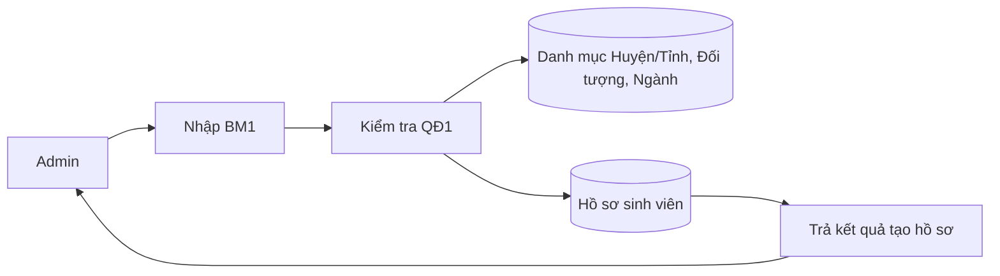
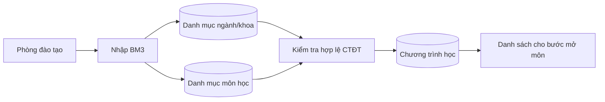
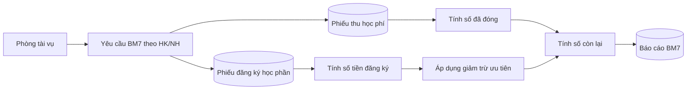

# 📋 YÊU CẦU PHẦN MỀM WEB

## Hệ thống Quản lý Đăng ký môn học và Thu học phí

---

## 1) Danh sách yêu cầu phần mềm

> Quy ước định dạng tiền tệ trong tài liệu: dùng đơn vị `VND` với dấu phẩy phân tách hàng nghìn (ví dụ: `27,000 VND`).

### 1.1 Yêu cầu nghiệp vụ
- Quản lý hồ sơ sinh viên theo BM1, áp dụng đúng QĐ1.
- Quản lý danh mục môn học theo BM2, tự tính tín chỉ theo QĐ2.
- Quản lý chương trình học theo ngành theo BM3, phục vụ lập môn mở theo QĐ3.
- Quản lý môn học mở từng học kỳ/năm học theo BM4, đúng QĐ4.
- Lập phiếu đăng ký học phần theo BM5, chỉ cho phép đăng ký môn có mở và tính tiền đăng ký theo QĐ5.
- Lập phiếu thu học phí theo BM6, hỗ trợ đóng nhiều lần nhưng phải trước hạn theo QĐ6.
- Lập báo cáo sinh viên chưa hoàn thành học phí theo BM7, tính tiền còn lại theo QĐ7.

### 1.2 Yêu cầu chất lượng
- **Đúng nghiệp vụ:** các ràng buộc QĐ1-QĐ7 được kiểm tra ở cả giao diện và backend/database.
- **Nhất quán dữ liệu:** dữ liệu biểu mẫu, phiếu đăng ký, phiếu thu và báo cáo phải đồng bộ theo học kỳ/năm học.
- **Bảo mật:** phân quyền tối thiểu cho Admin/Phòng đào tạo/Phòng tài vụ/Sinh viên theo chức năng.
- **Khả dụng:** các màn hình nhập BM1-BM7 cần thông báo lỗi rõ ràng, không mất dữ liệu khi nhập sai.
- **Truy vết:** lưu lịch sử lập/sửa phiếu và các lần thu học phí để đối soát.

### 1.3 Yêu cầu hệ thống
- Ứng dụng web client-server: Frontend React, Backend Node.js/Express, CSDL PostgreSQL.
- CSDL phải có đủ thực thể phục vụ BM1-BM7 và quan hệ cho QĐ1-QĐ7.
- API hỗ trợ CRUD cho sinh viên, môn học, học kỳ, đăng ký học phần, học phí, thanh toán và báo cáo.
- Hệ thống cho phép tra cứu theo học kỳ và năm học để tổng hợp công nợ.

---

## 2) Danh sách yêu cầu theo định dạng STT - Tên yêu cầu - Biểu mẫu - Quy định - Ghi chú

| STT | Tên yêu cầu | Biểu mẫu | Quy định | Ghi chú |
|---|---|---|---|---|
| 1 | Lập hồ sơ sinh viên | BM1 | QĐ1 | Quê quán, đối tượng ưu tiên, ngành học |
| 2 | Nhập danh sách môn học | BM2 | QĐ2 | Loại môn LT/TH, số tiết, số tín chỉ |
| 3 | Nhập chương trình học | BM3 | QĐ3 | Môn học theo ngành và học kỳ |
| 4 | Nhập môn học mở trong học kỳ | BM4 | QĐ4 | HK I, HK II, có thể có HK hè |
| 5 | Lập phiếu đăng ký học phần | BM5 | QĐ5 | Chỉ đăng ký môn đang mở, tính tiền đăng ký |
| 6 | Lập phiếu thu học phí | BM6 | QĐ6 | Thu nhiều lần, phải hoàn thành trước hạn |
| 7 | Lập báo cáo sinh viên chưa đóng học phí | BM7 | QĐ7 | Số tiền phải đóng <= số tiền đăng ký |

---

## 3) Danh sách biểu mẫu và quy định (BM1-BM7, QĐ1-QĐ7)

### 3.1 Biểu mẫu 1 và quy định 1
**BM1 - HỒ SƠ SINH VIÊN**
- Họ tên, Ngày sinh, Giới tính
- Quê quán
- Đối tượng
- Ngành học

**QĐ1**
- Quê quán gồm Huyện và Tỉnh; cần lưu danh sách Huyện/Tỉnh và trạng thái vùng sâu/vùng xa.
- Sinh viên có thể thuộc nhiều đối tượng ưu tiên; lấy đối tượng có ưu tiên cao nhất để giảm học phí (80%, 50%, 30%...).
- Mỗi Khoa có nhiều Ngành học; mỗi sinh viên thuộc một Ngành học.

### 3.2 Biểu mẫu 2 và quy định 2
**BM2 - DANH SÁCH MÔN HỌC**
- Mã môn học, Tên môn học, Loại môn, Số tiết.

**QĐ2**
- Loại môn: Lý thuyết (LT), Thực hành (TH).
- Tín chỉ:
  - LT: `số tín chỉ = số tiết / 15`
  - TH: `số tín chỉ = số tiết / 30`
- Quy tắc làm tròn tín chỉ đến 1 chữ số thập phân: nếu chữ số thập phân thứ 2 >= 5 thì làm tròn lên, nếu < 5 thì làm tròn xuống.
- Ví dụ: `2.15 -> 2.2`, `2.14 -> 2.1`.

### 3.3 Biểu mẫu 3 và quy định 3
**BM3 - CHƯƠNG TRÌNH HỌC**
- Ngành học, Khoa, Học kỳ, Môn học.

**QĐ3**
- Phòng đào tạo lập danh sách môn mở theo học kỳ dựa trên chương trình học các ngành.

### 3.4 Biểu mẫu 4 và quy định 4
**BM4 - DANH SÁCH MÔN HỌC MỞ**
- Học kỳ, Năm học, danh sách môn học mở.

**QĐ4**
- Năm học có hai học kỳ chính (HK I, HK II), có thể có học kỳ bổ sung (hè).

### 3.5 Biểu mẫu 5 và quy định 5
**BM5 - PHIẾU ĐĂNG KÝ HỌC PHẦN**
- Số phiếu, Mã số sinh viên, Ngày lập, Học kỳ, Năm học.
- Danh sách môn học và số tín chỉ.

**QĐ5**
- Thu học phí theo tín chỉ đăng ký:
  - LT: 27,000 VND/tín chỉ
  - TH: 37,000 VND/tín chỉ
- Sinh viên chỉ được đăng ký môn học có mở trong học kỳ/năm học.

### 3.6 Biểu mẫu 6 và quy định 6
**BM6 - PHIẾU THU HỌC PHÍ**
- Số phiếu, Ngày lập, Mã số sinh viên, Số tiền thu.

**QĐ6**
- Phiếu thu lập dựa trên phiếu đăng ký học phần.
- Cho phép đóng nhiều lần cho một phiếu đăng ký; phải hoàn thành trước hạn đóng học phí học kỳ.
- Nếu không hoàn thành trước hạn thì sinh viên không được tham dự kỳ thi cuối kỳ.

### 3.7 Biểu mẫu 7 và quy định 7
**BM7 - DANH SÁCH SINH VIÊN CHƯA HOÀN THÀNH ĐÓNG HỌC PHÍ**
- Học kỳ, Năm học, Mã số sinh viên, Số tiền đăng ký, Số tiền phải đóng, Số tiền còn lại.

**QĐ7**
- `0 <= Số tiền phải đóng <= Số tiền đăng ký` (do ưu tiên miễn/giảm học phí).
- Trường hợp `Số tiền phải đóng = 0` chỉ áp dụng khi sinh viên được miễn giảm 100%.
- BM7 chỉ liệt kê các trường hợp `Số tiền còn lại > 0`.

---

## 4) Sơ đồ luồng dữ liệu cho từng yêu cầu

> Ký hiệu nguồn dữ liệu chính:  
> - Tác nhân ngoài: Admin, Phòng đào tạo, Phòng tài vụ, Sinh viên  
> - Kho dữ liệu: Danh mục địa danh/đối tượng, Sinh viên, Môn học, Chương trình học, Môn mở, Đăng ký, Phiếu thu

### 4.1 Yêu cầu 1 - Lập hồ sơ sinh viên (BM1/QĐ1)
**Sơ đồ luồng dữ liệu (DFD mức xử lý):**

**Mô tả luồng dữ liệu**
1. Admin nhập thông tin BM1.
2. Hệ thống tra cứu dữ liệu địa danh, đối tượng và ngành.
3. Hệ thống xác định đối tượng ưu tiên cao nhất theo QĐ1 rồi lưu hồ sơ.

**Thuật toán chính**
1. Validate dữ liệu bắt buộc BM1.  
2. Kiểm tra mã địa danh/ngành hợp lệ.  
3. Lấy danh sách đối tượng của SV, chọn mức ưu tiên cao nhất.  
4. Ghi hồ sơ sinh viên và liên kết đối tượng.

### 4.2 Yêu cầu 2 - Nhập danh sách môn học (BM2/QĐ2)

**Mô tả luồng dữ liệu**
1. Phòng đào tạo nhập thông tin môn học.
2. Hệ thống xác thực loại môn và số tiết.
3. Hệ thống tính tín chỉ tự động, lưu vào danh mục môn học.

**Thuật toán chính**
1. Nếu loại môn = LT thì tín chỉ = số tiết / 15.  
2. Nếu loại môn = TH thì tín chỉ = số tiết / 30.  
3. Làm tròn tín chỉ đến 1 chữ số thập phân theo QĐ2 rồi lưu bản ghi môn học.

### 4.3 Yêu cầu 3 - Nhập chương trình học (BM3/QĐ3)

**Mô tả luồng dữ liệu**
1. Nhập ngành/khoa, học kỳ, môn học theo BM3.
2. Hệ thống kiểm tra môn học tồn tại và phù hợp ngành.
3. Lưu chương trình học làm nguồn lập môn mở.

**Thuật toán chính**
1. Kiểm tra cặp ngành-khoa hợp lệ.  
2. Kiểm tra môn học tồn tại.  
3. Không cho trùng môn trong cùng học kỳ/ngành.

### 4.4 Yêu cầu 4 - Nhập môn học mở trong học kỳ (BM4/QĐ4)

**Mô tả luồng dữ liệu**
1. Phòng đào tạo chọn học kỳ/năm học.
2. Hệ thống lấy môn từ chương trình học.
3. Danh sách môn mở được lưu và công bố cho đăng ký.

**Thuật toán chính**
1. Xác thực học kỳ thuộc HK I/HK II/HK hè.  
2. Lấy danh sách môn theo CTĐT.  
3. Lưu danh sách môn mở không trùng theo học kỳ/năm học.

### 4.5 Yêu cầu 5 - Lập phiếu đăng ký học phần (BM5/QĐ5)

**Mô tả luồng dữ liệu**
1. Sinh viên chọn môn trong học kỳ/năm học.
2. Hệ thống chỉ cho phép chọn môn đang mở.
3. Hệ thống tính tổng học phí đăng ký theo loại môn và tín chỉ.

**Thuật toán chính**
1. Với từng môn đăng ký: lấy loại môn + tín chỉ.  
2. Tính tiền môn:
   - LT = tín chỉ × 27,000 VND
   - TH = tín chỉ × 37,000 VND  
3. Cộng tổng và tạo phiếu BM5.

### 4.6 Yêu cầu 6 - Lập phiếu thu học phí (BM6/QĐ6)

**Mô tả luồng dữ liệu**
1. Phòng tài vụ nhận dữ liệu phiếu đăng ký.
2. Hệ thống ghi nhận số tiền thu từng lần.
3. Cập nhật công nợ và trạng thái hoàn thành trước hạn.

**Thuật toán chính**
1. Lấy tổng phải đóng của phiếu BM5.  
2. Tính đã thu lũy kế + số tiền thu lần này.  
3. Nếu quá hạn và còn nợ thì đánh dấu chưa đủ điều kiện dự thi.

### 4.7 Yêu cầu 7 - Báo cáo sinh viên chưa hoàn thành học phí (BM7/QĐ7)

**Mô tả luồng dữ liệu**
1. Tổng hợp số tiền đăng ký và số đã đóng theo học kỳ/năm học.
2. Áp dụng miễn giảm theo đối tượng ưu tiên.
3. Xuất danh sách sinh viên còn nợ.

**Thuật toán chính**
1. `số tiền phải đóng = số tiền đăng ký - số tiền miễn giảm`.  
2. Ràng buộc QĐ7: `số tiền phải đóng <= số tiền đăng ký`.  
3. `số tiền còn lại = số tiền phải đóng - số tiền đã đóng`; chỉ lấy bản ghi còn lại > 0.
